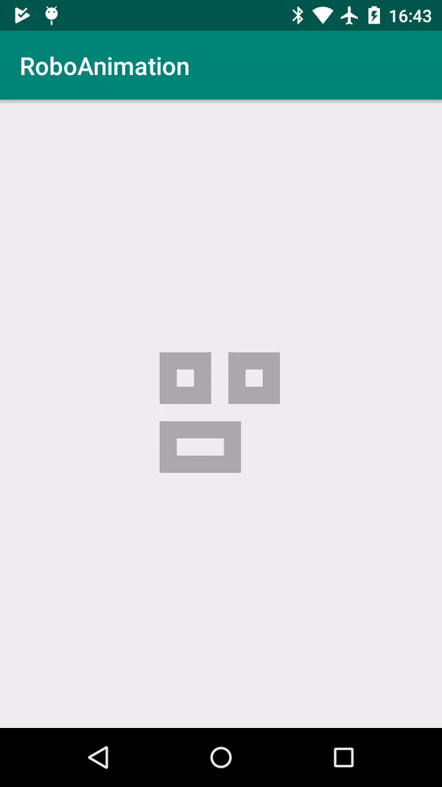

# RoboAnimation



[](https://opensource.org/licenses/Apache-2.0)
[](http://developer.android.com/index.html)
[](https://android-arsenal.com/api?level=16)

Created this cool [loader animation](https://dribbble.com/shots/5836300-Loader-XLVI) from [Oleg Frolov](https://dribbble.com/Volorf) as an android sample application. 

USAGE
-----

Just add RoboLoader module in your project via Gradle and add RoboLoader view in your layout XML:

XML
-----

```xml
    <com.pro2on.roboanimation.RoboLoader
        android:id="@+id/roboLoader"
        android:layout_width="100dp"
        android:layout_height="100dp"
        android:color="@android:color/darker_gray"
        />
```

##### Properties:

* `android:color`                   (color)     -> default  #f5f5f5


LICENCE
-----

Sample is licensed under an [Apache License 2.0](http://www.apache.org/licenses/LICENSE-2.0).
